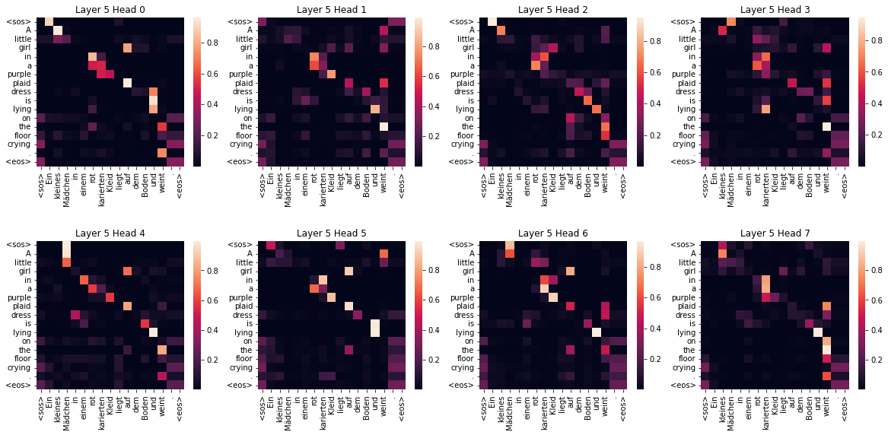
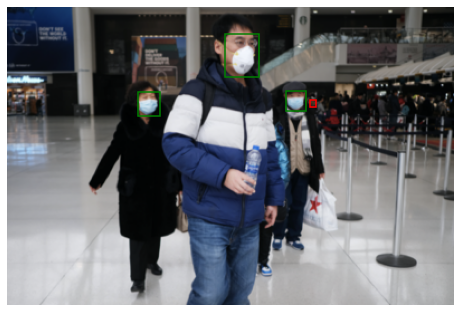
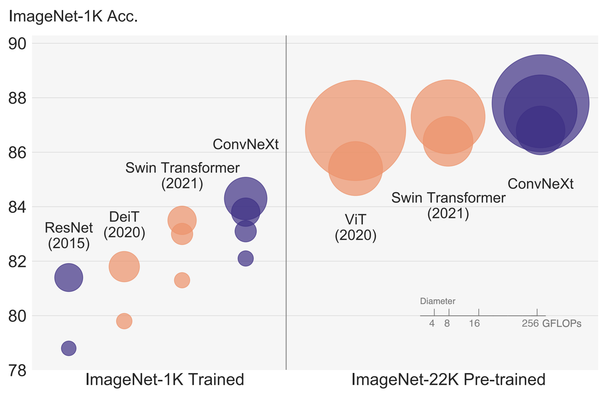
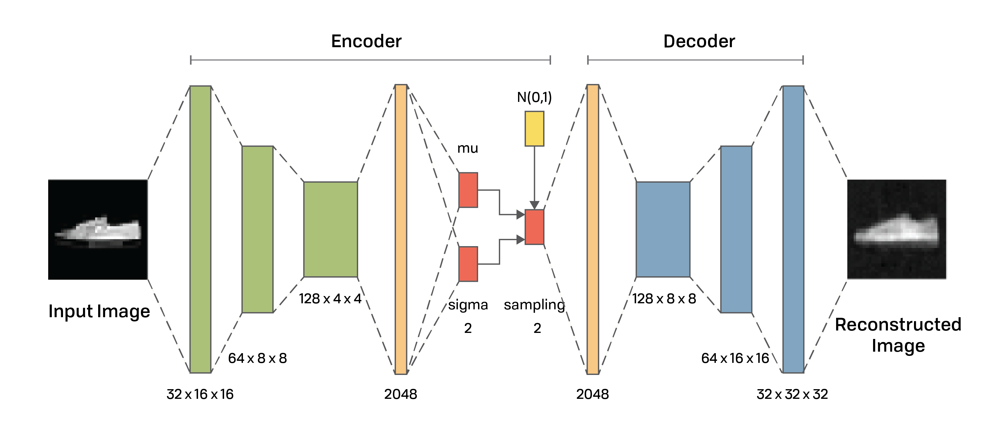

# Deep Learning Playground

## Introduction:

This repository is a collection of my Deep Learning studies and experiments. \
There're two types of notebooks in this collection:

- **\[HC\]** (Hardcoded): The notebook begins with this tag indicates the work impliments the algorithm from scratch with PyTorch. My purpose of doing these hard-coded work is to build a solid understanding on the influencial deep learning algorithms;

- **\[FT\]** (Fine Tunning): This kind of notebook was built upon 

 

# Notebooks:

## 5. \[HC\] Transformer for EN to DE Translation

[Google Colab](https://colab.research.google.com/github/terrence-ou/DL_Playground/blob/main/Transformer_From_Scratch_PyTorch.ipynb) | [Notebook](https://github.com/terrence-ou/DL_Playground/blob/main/Transformer_From_Scratch_PyTorch.ipynb)  
Related Paper: [Attention Is All You Need](https://arxiv.org/abs/1706.03762) 
Dataset: [Multi30K](https://github.com/multi30k/dataset)  
Code Reference: [The Annotated Transformer](http://nlp.seas.harvard.edu/annotated-transformer/) by Sasha Rush et al.  

 
The Transformer is the cornerstone of the most advanced NLP, Computer Vision, and Generative models. I tried to code the Transformer from scratch (with PyTorch) to get a thorough understanding of the encoder-decoder structure, attention mechanism, and basic pipeline of a language model. 

---
 

## 4. \[HC\]  LAS for Speech Recognition

[Google Colab](https://colab.research.google.com/github/terrence-ou/DL_Playground/blob/main/LAS_Speech_Recognition.ipynb) | [Notebook](https://github.com/terrence-ou/DL_Playground/blob/main/LAS_Speech_Recognition.ipynb)  
Realted Paper: [Listen, Attend, and Spell](https://arxiv.org/abs/1508.01211) 
Dataset: [Attention-based Speech Recognition](https://www.kaggle.com/competitions/11-785-f22-hw4p2/) 

 
LAS is a comprehensive model that includes sequencial models (pBLSTM and LSTM cells), attention mechanism, and encoder-decoder structure. The model has some exciting part, like pBLSTM, teacher forcing, hidden layer concatenation, etc., that makes training effective and efficient; these features are all implemented in this notebook.

---
 

## 3. \[FT\] FasterRCNN for Mask Detection

[Google Colab](https://colab.research.google.com/github/terrence-ou/DL_Playground/blob/main/Finetunning_FasterRCNN_Mask_Detection.ipynb) | [Notebook](https://github.com/terrence-ou/DL_Playground/blob/main/Finetunning_FasterRCNN_Mask_Detection.ipynb)  
Dataset: [Face Mask Detection](https://www.kaggle.com/datasets/andrewmvd/face-mask-detection) 

Code Reference: [PyTorch Faster-RCNN](https://www.kaggle.com/code/daniel601/pytorch-fasterrcnn) by Daniel

 
Object detection is one of the most fundamental and widely-applied task in the field of Computer Vision. In this notebook, I tried to finetune a well-developed model, FasterRCNN, to understand the fintunning task pipeline for object detection task. 

---
 

## 2. \[HC\]  ConvNeXt, with Center Loss, for Face Recognition and Verification

[Google Colab](https://colab.research.google.com/github/terrence-ou/DL_Playground/blob/main/ConvNeXt_CenterLoss_Face_Classification_Verification.ipynb) | [Notebook](https://github.com/terrence-ou/DL_Playground/blob/main/ConvNeXt_CenterLoss_Face_Classification_Verification.ipynb)  
Realted Paper: [A ConvNet for the 2020s](https://arxiv.org/abs/2201.03545) 
Dataset: [Face Verification](https://www.kaggle.com/competitions/11-785-f22-hw2p2-verification) 

<figcaption>Image source: A ConvNet for the 2020s</figcaption>

 
ConvNeXt is a new convolutional network that publish in 2022, with the advantage of a higher classification accuracy compare to previous convnets like ResNet. The model features with its unique block: a depth-wise convolution with a larger 7*7 kernel size, a layer normalization followed by pointwise convolution, etc. I also added Center Loss in training to further separate feature clusters for a higher classification and verification accuracy.

---
 

## 1. \[HC\] Variational AutoEncoder

[Google Colab](https://colab.research.google.com/github/terrence-ou/DL_Playground/blob/main/Variational_AutoEncoder.ipynb) | [Notebook](https://github.com/terrence-ou/DL_Playground/blob/main/Variational_AutoEncoder.ipynb)  
Realted Paper: [An Introduction to Variational Autoencoders
](https://arxiv.org/abs/1906.02691) 

 
The encoder-decoder model is the fundation of many of nowadays generative models. I hard-codded this Variational AutoEncoder model to learn the fundamentals of bottleneck network, latent space probalibity distribution (and a bit t-SNE), and optimizing model with multiple loss functions.

---
 
